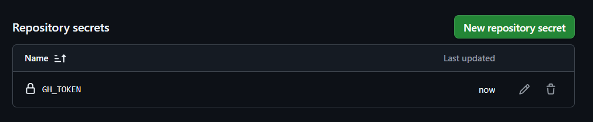

# GitHub CLI y GitHub Actions

## Autenticación

```bash
echo "${{ secrets.GH_TOKEN }}" | gh auth login --with-token
```

Aquí, el token es enviado por ``echo`` a través de una tubería (|), lo que significa que el token se pasa como entrada estándar (stdin) al comando, como si el usuario lo escribiera después de ejecutar el comando.

```bash
gh pr view [PR_NUMBER] --json closingIssuesReferences
```

```json
{
  "closingIssuesReferences": [
    {
      "id": "I_kwDOOqr6t8621N9V",
      "number": 2,
      "repository": {
        "id": "R_kgDOOqr6tw",
        "name": "MyRepo",
        "owner": {
          "id": "U_kgDOBtYHfA",
          "login": "AldoLunaBueno"
        }
      },
      "url": "https://github.com/AldoLunaBueno/MyRepo/issues/2"
    }
  ]
}
```


